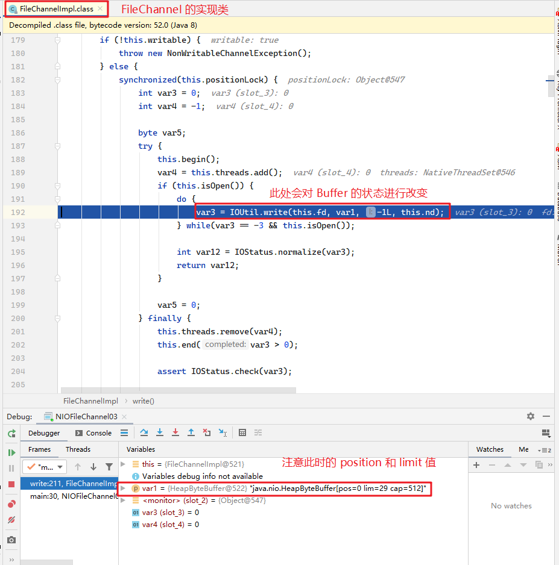
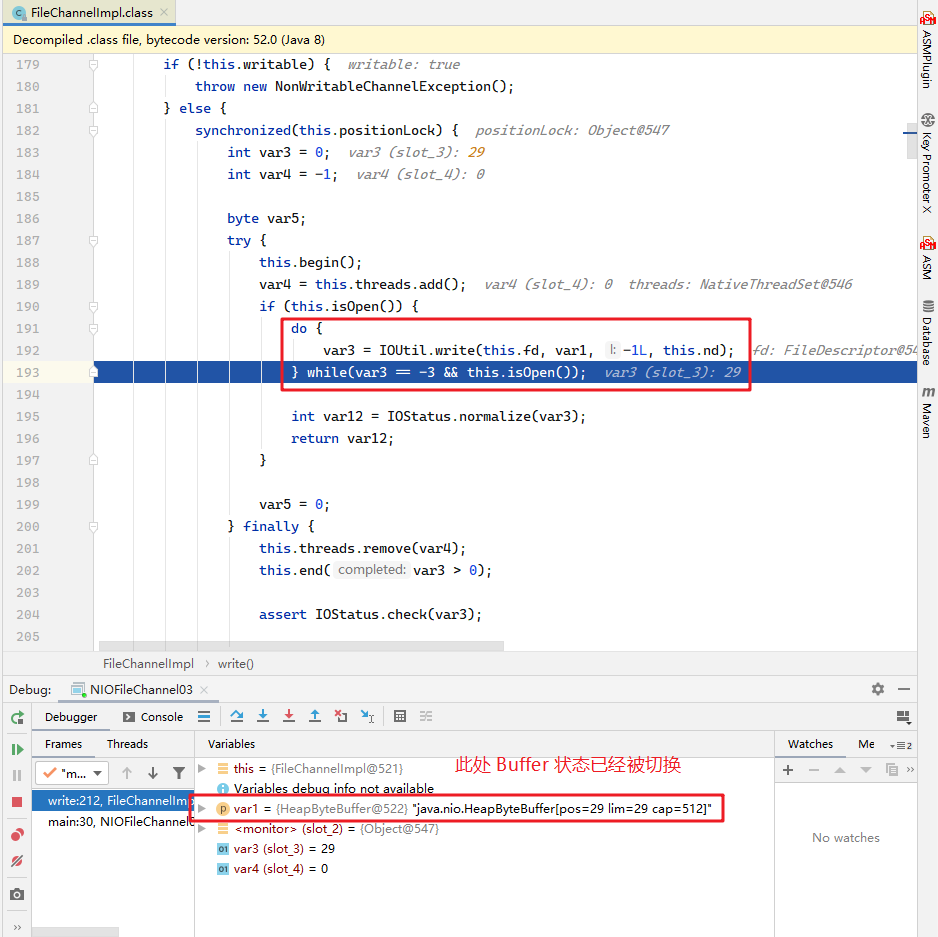

# BIO

同步阻塞型 IO，典型的工作流程：

- 服务器监听端口
- 客户端发送请求
- 服务器接收客户端的请求，创建连接
- 客户端发送数据，服务器接收数据
- ······
- 客户端断开连接，服务器线程执行完毕，被线程池回收

# NIO

## Buffer

实际就是一个数组用来存储数据，可存即可写。然后用两根指针 position 和 limit 来标志存的位置和读的位置，存后可读。

拥有 InputStream 和 OutputStream 的功能，中途使用 flip() 即可完成转换，有状态机的思想。

```java
while (true) {
    //byteBuffer.clear();
    int read = fileChannel01.read(byteBuffer);
    if (read == -1) {
        break;
    }
    byteBuffer.flip();
    fileChannel02.write(byteBuffer);
}
```
上面的代码，如果注释了 clear() 这一栏，将会陷入死循环。

Buffer 存储了数据，在读和写的时候会改变 position 和 limit 指针。

虽然 flip() 方法会切换读和写，但是在 FileChannel 调用读写方法的时候，会再次改变 Buffer 的读写状态。

Debug 可以看到：





所以，循环读取的时候，因为已经读取到了 limit 的位置，接下来读取的数值是初始值，即为 0。而 if 判断不会进入，所以陷入死循环。